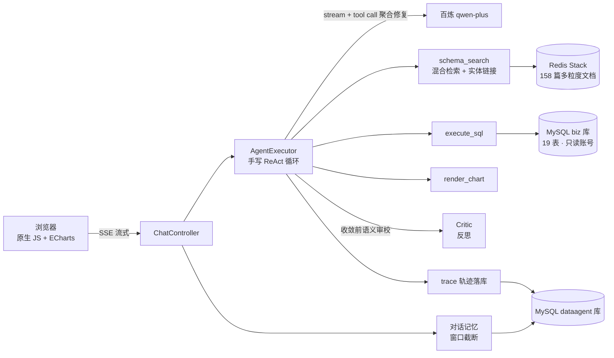

# DataAgent —— 智能数据分析 Agent

用自然语言（或**带一张图**）问数据问题（如"顺丰快递的妥投率是多少？"），Agent 对一个 **19 表的准真实电商库**
做 schema linking、生成 SQL、执行查询、**语法出错自我修正 + 语义反思复核**，最后给出 ECharts 图表
和有数字支撑的结论。基于**多模态模型 qwen3.7-plus**，还能读懂上传的看板/表格截图并结合库里数据对账。
全程 SSE 流式输出，每步推理可回放。

> **手写 ReAct 循环**（不依赖框架的自动工具执行）：消息管理、流式 tool call 增量聚合与修复、
> 轮数控制、错误自愈、出图兜底、收敛前语义反思、多模态图片输入，全部自己实现——这是本项目的核心。


<!-- TODO: 录制演示 GIF（提问 → 打字机流式 → 轨迹面板展开 → 图表渲染）放这里 -->

| 占比（pie） | 排行（bar） |
|---|---|
|  |  |

## 评测结果

面向 19 表大库的自建评测集 [eval/questions-v2.txt](eval/questions-v2.txt)（20 题，专打一词多义
`status`、命名不一致的时间字段、实体链接、遗留拼音表、语义口径陷阱）：

| 指标 | 结果 |
|---|---|
| SQL 一次成功率 | **100%**（20/20） |
| 任务完成率 | **100%**（20/20） |
| 平均耗时 | 16.9s / 题 |
| 平均 SQL 尝试 | 1.40 次 |

数值经手工查库核验（品牌销售额 Top5、白牌占比 23.1%、各品类动销率等）与库精确一致。

**自愈 vs 反思，抓的是两类错**：
- *语法自愈*：模型误用不存在的 `o.created_at` 列 → 数据库报错原文回传 → 自行改用 `order_time` 重试成功。
- *语义反思*：问"注册城市≠收货城市的用户数"，模型初版漏了"一个用户多个收货地址"导致重复计数 →
  收敛前 Critic 审校打回 → 改为只关联默认地址（`is_default=1`）去重，结果修正。这类错 **SQL 能跑通、不报错**，
  只有语义审校能抓。

## 架构



一轮问答的执行流：

```
用户问题 → [模型流式推理 → 工具调用 → 结果回填] × N 轮 → 语义反思 → 最终回答 + 图表
              ↑____________ SQL 报错原文回传，触发语法自我修正（最多 3 次）
              ↑____________ 收敛前规则检查：该出图没出图时注入一次提醒（guardrail）
              ↑____________ 收敛前 Critic 审校：口径/语义错则打回重做（Reflexion）
```

## 核心设计

- **手写 ReAct 循环**：`internalToolExecutionEnabled(false)` 拿到原始 tool call 自行解析分发；
  三重终止条件（模型收敛 / 最大 10 轮 / SQL 连续失败 3 次）
- **SSE 流式**：每轮 `chatModel.stream()`，文本增量实时推送（打字机）；tool call 分片按
  OpenAI 风格增量协议手写聚合，并做**括号平衡修复**（DashScope 偶发丢参数尾部分片，
  损坏 JSON 回传会被 400 拒绝）
- **RAG schema linking**（19 表脏库的核心）：单一 catalog 生成**多粒度文档**（表 / 列 / 取值 / 口径，
  共 158 篇）入 Redis；**混合检索**——稠密向量 + 词法（CJK 字符 bigram + IDF，无需分词器）双路
  **RRF 融合**；**确定性实体链接**把问题里的枚举值（顺丰→`shipment.carrier`、核销→`used`）直接锁到字段，
  结构化输出命中表的完整列 + 取值映射 + 口径，专克一词多义 `status`、命名不一致的时间字段
- **语义反思（Reflexion）**：收敛前独立 Critic 审"问题+SQL+结果+草稿"是否口径正确，
  专抓 SQL 跑得通但语义错的**静默错误**（分品类误用 `total_amount`、漏有效订单过滤、多地址重复计数），
  判 revise 打回主循环重做（限 1 次防拉锯，fail-open 不误伤正确结果）。做成可配置开关
  `agent.reflect.enabled`——[A/B 实测](eval/questions-ab.txt)表明其收益与底座模型强弱成反比
- **多模态输入**：`/api/chat` 接受可选 `image`（data URI），构建带 `Media` 的多模态 UserMessage，
  qwen3.7-plus 直接读图。可"上传外部看板/表格截图 → 读出数据 → 自动查库对账"（视觉 + Text-to-SQL 工具链）
- **SQL 三层防线**：语句校验（仅 SELECT/WITH、黑名单、禁多语句）→ 数据库只读账号（仅 biz 库
  SELECT 权限）→ 10s 超时 + 200 行截断；API Key 只读环境变量，不进仓库
- **出图兜底**：提示词对出图时机遵从不稳定 → 收敛前规则检查，结果是"标签+数值"多行且未出图时
  注入一次提醒，明细清单类模型仍可拒绝
- **全链路可观测**：每步思考/工具调用落库（`agent_trace_step`），`GET /api/traces/{id}` 回放；
  前端执行轨迹面板实时展示

## 快速开始

```bash
# 需要：Docker、阿里云百炼 API Key（https://bailian.console.aliyun.com/）
export DASHSCOPE_API_KEY=sk-xxx        # Windows PowerShell: $env:DASHSCOPE_API_KEY="sk-xxx"
docker compose up -d --build
# 打开 http://localhost:8080
```

样例数据（电商 **19 表**：用户/会员/地址、商品/品牌/品类/库存/评价、订单/明细、支付/退款/物流、
优惠券/活动，3000 订单）随 MySQL 容器初始化自动灌入，固定随机种子 + 相对当前日期生成，
"上个月"类问题任何时候都有数据。

本地开发：`docker compose -f docker-compose.dev.yml up -d` 只起 MySQL(3307)/Redis(6380)，应用在 IDE 里跑。

跑评测：`python eval/run_eval.py --questions eval/questions-v2.txt`（应用启动后）。

## 技术栈

Java 21 · Spring Boot 3.5 · Spring AI（OpenAI 客户端 → 阿里云百炼 OpenAI 兼容端点，
多模态 **qwen3.7-plus** / text-embedding-v4）· MySQL 8 · Redis Stack（RediSearch 向量检索）·
原生 JS + ECharts · Docker 多阶段构建

## 项目结构

```
src/main/java/com/yang/dataagent/
├── agent/    # 手写 ReAct 循环：AgentExecutor、Critic 反思、流式聚合与 JSON 修复、事件监听
├── tool/     # schema_search（schema linking）/ execute_sql（SqlGuard）/ render_chart
├── rag/      # SchemaKnowledge catalog、多粒度文档、HybridSchemaRetriever（稠密+词法 RRF）
├── memory/   # 对话历史持久化 + 窗口截断
├── trace/    # 执行轨迹落库 + 回放接口
├── web/      # ChatController（SSE）
└── config/   # 数据源、向量库、Agent 参数
eval/         # 原 20 题 + v2 20 题（大库/脏命名/反思）评测集 + 跑批脚本 + 结果
```
