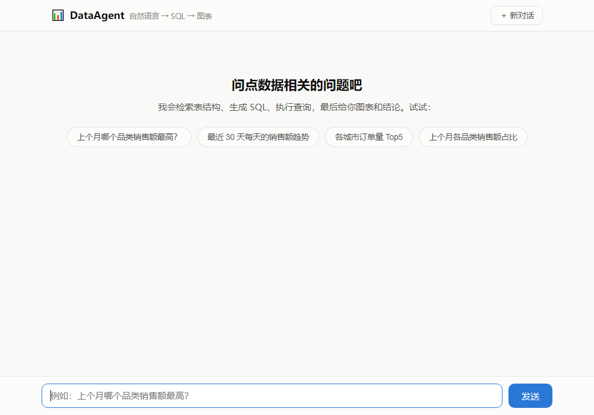
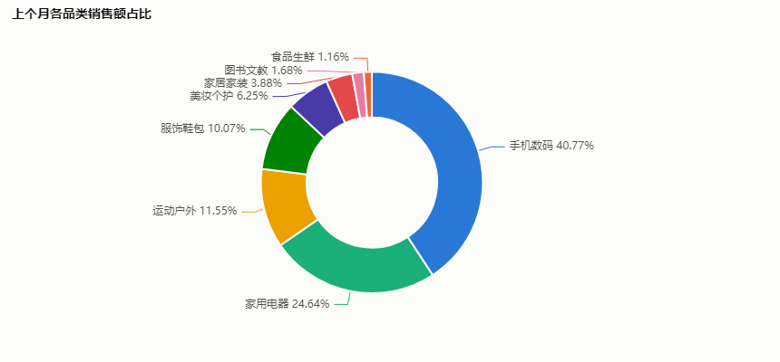
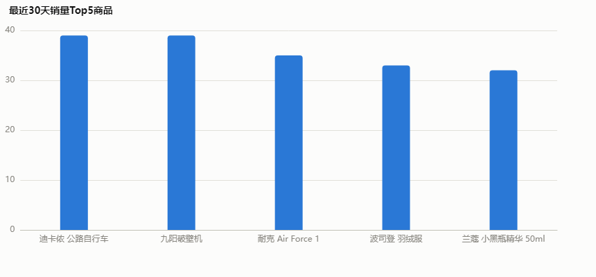
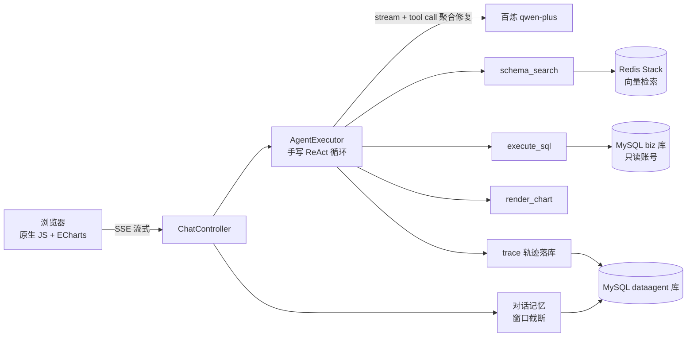

# DataAgent —— 智能数据分析 Agent

用自然语言问数据问题（如"上个月哪个品类销售额最高？"），Agent 自动检索表结构、生成 SQL、执行查询、
**出错自我修正**，最后给出 ECharts 图表和有数字支撑的结论。全程 SSE 流式输出，每步推理可回放。

> **手写 ReAct 循环**（不依赖框架的自动工具执行）：消息管理、流式 tool call 增量聚合与修复、
> 轮数控制、错误自愈、出图兜底，全部自己实现——这是本项目的核心。



<!-- TODO: 录制演示 GIF（提问 → 打字机流式 → 轨迹面板展开 → 图表渲染）放这里 -->

| 占比（pie） | 排行（bar） |
|---|---|
|  |  |

## 评测结果

自建 20 题评测集（单表聚合 / 多表 join / 时间窗口 / 业务口径 / 排行趋势占比，见 [eval/](eval/)）：

| 指标 | 结果 |
|---|---|
| SQL 一次成功率 | **90%**（18/20） |
| SQL 自愈后成功率 | **100%**（20/20） |
| 任务完成率 | **100%**（20/20） |
| 平均耗时 | 14.6s / 题 |

自愈实例：模型误用不存在的 `o.created_at` 列 → 数据库报错原文回传 → 模型自行改用 `order_time` 重试成功。

## 架构



一轮问答的执行流：

```
用户问题 → [模型流式推理 → 工具调用 → 结果回填] × N 轮 → 最终回答 + 图表
              ↑____________ SQL 报错原文回传，触发自我修正（最多 3 次）
              ↑____________ 收敛前规则检查：该出图没出图时注入一次提醒（guardrail）
```

## 核心设计

- **手写 ReAct 循环**：`internalToolExecutionEnabled(false)` 拿到原始 tool call 自行解析分发；
  三重终止条件（模型收敛 / 最大 10 轮 / SQL 连续失败 3 次）
- **SSE 流式**：每轮 `chatModel.stream()`，文本增量实时推送（打字机）；tool call 分片按
  OpenAI 风格增量协议手写聚合，并做**括号平衡修复**（DashScope 偶发丢参数尾部分片，
  损坏 JSON 回传会被 400 拒绝）
- **RAG schema 检索**：表 DDL 与业务口径（销售额=有效订单明细汇总等）向量化入 Redis，
  按问题 topK 检索注入，上下文不随表数量膨胀
- **SQL 三层防线**：语句校验（仅 SELECT/WITH、黑名单、禁多语句）→ 数据库只读账号（仅 biz 库
  SELECT 权限）→ 10s 超时 + 200 行截断；API Key 只读环境变量，不进仓库
- **出图兜底**：提示词对出图时机遵从不稳定 → 收敛前规则检查，结果是"标签+数值"多行且未出图时
  注入一次提醒，明细清单类模型仍可拒绝
- **全链路可观测**：每步思考/工具调用落库（`agent_trace_step`），`GET /api/traces/{id}` 回放；
  前端执行轨迹面板实时展示

## 快速开始

```bash
# 需要：Docker、阿里云百炼 API Key（https://bailian.console.aliyun.com/）
export DASHSCOPE_API_KEY=sk-xxx        # Windows PowerShell: $env:DASHSCOPE_API_KEY="sk-xxx"
docker compose up -d --build
# 打开 http://localhost:8080
```

样例数据（电商 4 表：用户/商品/订单/明细，3000 订单）随 MySQL 容器初始化自动灌入，
固定随机种子 + 相对当前日期生成，"上个月"类问题任何时候都有数据。

本地开发：`docker compose -f docker-compose.dev.yml up -d` 只起 MySQL(3307)/Redis(6380)，应用在 IDE 里跑。

跑评测：`python eval/run_eval.py`（应用启动后）。

## 技术栈

Java 21 · Spring Boot 3.5 · Spring AI Alibaba（百炼 qwen-plus / text-embedding-v4）·
MySQL 8 · Redis Stack（RediSearch 向量检索）· 原生 JS + ECharts · Docker 多阶段构建

## 项目结构

```
src/main/java/com/yang/dataagent/
├── agent/    # 手写 ReAct 循环：AgentExecutor、流式聚合与 JSON 修复、事件监听
├── tool/     # schema_search / execute_sql（SqlGuard）/ render_chart
├── rag/      # schema 向量化与检索
├── memory/   # 对话历史持久化 + 窗口截断
├── trace/    # 执行轨迹落库 + 回放接口
├── web/      # ChatController（SSE）
└── config/   # 数据源、向量库、Agent 参数
eval/         # 20 题评测集 + 跑批脚本 + 结果
```
