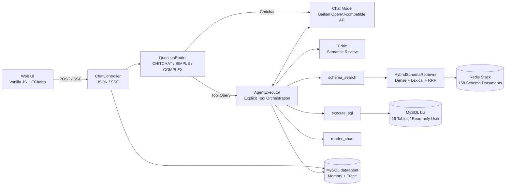

# QueryPilot

> 面向电商场景的智能数据分析 Agent：理解自然语言或看板截图，完成 Schema Linking、安全 Text-to-SQL、错误自愈、语义审校与 ECharts 可视化。

QueryPilot 不是一次性的“问题 → SQL”封装，而是一条可控制、可观测、可评测的多轮数据分析链路。项目使用 Java 21、Spring Boot 3.5 和 Spring AI 接入阿里云百炼 OpenAI 兼容端点，在 19 张刻意包含多义字段、命名不一致和遗留命名的电商表上验证 Agent 的选表、写 SQL、纠错与收敛能力。


| 销售额占比 | 品类排行 |
|---|---|
|  |  |

## 目录

- [核心能力](#核心能力)
- [系统架构](#系统架构)
- [一次请求如何执行](#一次请求如何执行)
- [关键设计](#关键设计)
- [评测与结果](#评测与结果)
- [快速开始](#快速开始)
- [接口与配置](#接口与配置)
- [项目结构](#项目结构)
- [安全边界](#安全边界)
- [后续计划](#后续计划)

## 核心能力

| 能力 | 实现 |
|---|---|
| 显式 Agent 编排 | 自主实现 ReAct 风格工具循环，管理消息、流式 Tool Call、工具分发、重试与终止 |
| Schema Linking | 158 篇表/列/取值/口径文档，稠密召回与词法召回经 RRF 融合，并补充确定性实体链接 |
| SQL 自愈 | 将数据库错误作为工具结果回填模型，连续失败达到阈值后终止 |
| 语义审校 | Critic 在收敛前检查问题、SQL、结果和草稿，处理 SQL 可执行但业务口径错误的静默问题 |
| 自适应路由 | 将问题分为 CHITCHAT、SIMPLE、COMPLEX，动态控制是否调用工具、最大轮数与是否审校 |
| SQL 安全 | 只读语句校验、数据库只读账号、10 秒超时与 200 行返回上限 |
| 稳定可视化 | 模型只提供图表数据和意图，服务端校验并确定性组装 ECharts Option |
| 流式与可观测 | SSE 推送文本增量和执行步骤；对话记忆与完整工具轨迹持久化 |
| 多模态输入 | 支持上传看板或表格截图，并结合业务库数据继续分析 |

## 系统架构



框架负责模型调用、消息类型、Embedding 和 Redis VectorStore；项目代码负责每轮消息管理、Tool Call 聚合与修复、工具分发、SQL 重试、出图兜底、Critic 打回、路由和 Trace。

## 一次请求如何执行

```text
用户问题 / 图片
    ↓
QuestionRouter：CHITCHAT / SIMPLE / COMPLEX
    ↓
模型流式输出文本或 Tool Call
    ↓
schema_search → execute_sql →（需要时）render_chart
    ↑                    ↓
    └──── 数据库错误回填，模型下一轮修正 SQL
    ↓
出图兜底检查 →（COMPLEX）Critic 语义审校
    ↓
最终回答 + SQL + 查询结果 + ECharts Option + Steps
    ↓
记忆与执行轨迹落库，SSE 推送完成事件
```

终止条件包括：模型正常收敛、SQL 连续失败 3 次，以及 SIMPLE/COMPLEX 达到各自最大轮数。

## 关键设计

### 1. 显式工具编排

`AgentExecutor` 关闭 Spring AI 内部自动工具执行，通过 `internalToolExecutionEnabled(false)` 获取原始 Tool Call，并自行完成：

- System、历史消息和当前问题的组装；
- 流式文本与 Tool Call arguments 分片聚合；
- 工具查找、参数传递与结果回填；
- SQL 连续失败计数和最大轮数控制；
- 出图提醒与 Critic 打回；
- 每个可见中间步骤和工具调用的 Trace 记录。

联调中曾观察到兼容端点流式 Tool Call arguments 偶发不完整。`ToolCallJsonRepair` 会对可判断的缺尾 JSON 做保守修复；仍无法修复时降级为普通工具参数错误，复用现有自愈路径，避免协议异常直接中断整个 Agent。

### 2. 从 RAG 到 Schema Linking

`SchemaKnowledge` 是应用侧 Schema 知识目录，生成 158 篇多粒度文档：

| 文档类型 | 数量 | 内容 |
|---|---:|---|
| 表 | 19 | 表用途、列摘要和常见问法 |
| 列 | 116 | 字段类型、语义和关联关系 |
| 取值 | 11 | “顺丰”“金卡会员”等实体到字段的映射 |
| 业务口径 | 12 | GMV、客单价、退款率、妥投率等定义 |

检索同时使用两路信号：

- **稠密召回**：`text-embedding-v4 + RedisVectorStore`，处理语义近似；
- **词法召回**：CJK bigram + ASCII token + IDF，处理字段名、英文枚举和精确实体；
- **RRF 融合**：两路各取 20 个候选，按排名融合后返回 Top 8；
- **实体链接**：已知枚举值直接链接字段，例如“顺丰” → `shipment.carrier`。

工具最终最多渲染 6 张相关表的完整字段，并附上取值映射与业务口径，减少模型猜测表名或字段名。

### 3. 显式错误与静默错误分层处理

两类错误使用不同机制：

1. **SQL 执行错误**：MySQL 错误原文作为 Tool Response 回填，模型下一轮重写 SQL；
2. **业务语义错误**：SQL 可以执行但口径可能错误时，Critic 检查原问题、SQL、查询结果和草稿结论，判定 `revise` 后打回主循环。

Critic 与主 Agent 共用同一底座模型，但采用隔离的提示词和上下文。调用或解析异常时 fail-open，优先保证主流程可用；它是增强审校，不是真值验证器。

### 4. Router 控制反思成本

历史回归中，Critic 能修正硬口径问题，也可能对“城市”等模糊维度过度纠偏。`QuestionRouter` 因此将问题分档：

| 档位 | 工具 | 最大轮数 | Critic |
|---|---:|---:|---:|
| CHITCHAT | 否 | 单次模型调用 | 否 |
| SIMPLE | 是 | 7 | 否 |
| COMPLEX | 是 | 10 | 是，最多打回 1 次 |

当前使用可解释、可单测的启发式规则，不增加额外 LLM 分类调用。路由理由会作为第 0 轮 Step 写入 Trace。

### 5. SQL 三层只读防线

```text
SqlGuard：仅允许单条 SELECT/WITH，拒绝注释、多语句和危险关键字
    ↓
MySQL：独立 agent_ro 账号，仅拥有 biz 库 SELECT 权限
    ↓
JdbcTemplate：10 秒查询超时，最多向模型返回 200 行
```

这些机制降低写入和上下文膨胀风险，但正则校验不是完整 SQL Parser，200 行限制也不限制数据库扫描量。生产化仍需 AST、表列白名单、`EXPLAIN` 成本门禁、字段脱敏和租户权限。

### 6. 确定性图表与 SSE

模型只提供 `chartType`、标题、分类和 Series 数据；`RenderChartTool` 校验后组装 bar、line 或 pie 的 ECharts Option，避免模型直接生成复杂 Option 带来的格式与样式波动。

前端通过 `fetch + ReadableStream` 消费 POST SSE，展示文本增量、工具调用和执行步骤。当前实现不是 `EventSource`，因此没有自动重连和断点续传。

## 评测与结果

### 数据集

| 数据集 | 题数 | 重点 |
|---|---:|---|
| `eval/questions.txt` | 20 | 基础查询、排行、趋势与出图 |
| `eval/questions-v2.txt` | 20 | 19 表、脏命名、业务黑话与复杂关联 |
| `eval/questions-ab.txt` | 6 | Critic 语义陷阱 |

### 指标定义

- **SQL 一次成功率**：首个 `execute_sql` 没有执行错误 / 实际执行过 SQL 的题目；
- **SQL 自愈后成功率**：最终至少存在一次成功 SQL / 实际执行过 SQL 的题目；
- **任务完成率**：Agent 在轮数与重试限制内返回 `success=true` / 全部题目。

这些指标衡量执行链路，不等同于最终答案的自动语义准确率。结果 JSON 保留 SQL 和答案，当前数值与口径主要通过人工抽查。

### 历史基线

2026-07-10，`qwen3.6-flash`，Router 开启、Critic 按复杂题启用：

| 指标 | 结果 |
|---|---:|
| 任务完成率 | **45/46 = 97%** |
| SQL 一次成功率 | **46/46 = 100%** |
| 平均耗时 | **15.8 秒/题** |

唯一未完成题的首条 SQL 可以执行，但 Agent 在 10 轮内没有完成多维趋势分析，因此“SQL 可执行”和“任务完成”被分别统计。明细见 `eval/results-20260710-*.json`。

> 当前 `application.yml` 的本地默认模型为 `qwen3.7-flash`，尚未保存同配置下的完整 46 题回归。以上数字只属于注明日期和模型的历史基线。

运行评测：

```bash
python eval/run_eval.py --questions eval/questions.txt
python eval/run_eval.py --questions eval/questions-v2.txt
python eval/run_eval.py --questions eval/questions-ab.txt
```

## 快速开始

### 环境要求

- Docker Engine + Docker Compose；
- 或 Java 21 + Maven 3.9（本地开发）；
- 阿里云百炼 API Key。

### 一键启动

PowerShell：

```powershell
$env:DASHSCOPE_API_KEY="your-api-key"
docker compose up -d --build
```

Bash：

```bash
export DASHSCOPE_API_KEY="your-api-key"
docker compose up -d --build
```

打开 [http://localhost:8080](http://localhost:8080)。MySQL 会初始化 19 张电商表和样例数据；Redis Stack 在启动阶段写入 Schema 向量索引。

停止服务：

```bash
docker compose down
```

### 本地开发

```bash
docker compose -f docker-compose.dev.yml up -d
mvn spring-boot:run
```

本地端口：应用 `8080`、MySQL `3307`、Redis Stack `6380`。

## 接口与配置

### 核心接口

| Method | Path | 用途 |
|---|---|---|
| POST | `/api/chat` | 同步 JSON 对话，评测脚本使用 |
| POST | `/api/chat/stream` | SSE 流式对话，Web UI 使用 |
| GET | `/api/traces?conversationId=...` | 查询某个对话的执行轨迹列表 |
| GET | `/api/traces/{id}` | 回放单次执行的完整步骤 |

同步请求示例：

```bash
curl -X POST http://localhost:8080/api/chat \
  -H "Content-Type: application/json" \
  -d '{"question":"上个月哪个品类销售额最高？"}'
```

请求还可以携带 `conversationId` 延续对话，或使用 `image` 传递 data URI/base64 图片。

### 关键配置

| 配置 | 默认值 | 作用 |
|---|---:|---|
| `agent.router.simple-max-rounds` | 7 | SIMPLE 最大轮数 |
| `agent.router.complex-max-rounds` | 10 | COMPLEX 最大轮数 |
| `agent.sql.max-retries` | 3 | SQL 连续失败终止阈值 |
| `agent.sql.timeout-seconds` | 10 | JDBC 查询超时 |
| `agent.sql.max-rows` | 200 | 返回给模型的最大行数 |
| `agent.rag.dense-k` | 20 | 稠密与词法每路候选数 |
| `agent.rag.top-k` | 8 | RRF 融合后的文档数 |
| `agent.memory.window-size` | 20 | 注入模型的历史消息数 |
| `agent.reflect.max-reflections` | 1 | 单次对话最大打回次数 |

API Key 仅从环境变量读取，不写入仓库。

## 技术栈

- Java 21、Spring Boot 3.5、Spring AI 1.1；
- 阿里云百炼 OpenAI 兼容端点、`text-embedding-v4`；
- MySQL 8、Spring Data JPA、JdbcTemplate；
- Redis Stack / RediSearch；
- 原生 JavaScript、ECharts、SSE；
- Maven、Docker Compose、多阶段 Docker 构建。

## 项目结构

```text
src/main/java/com/yang/dataagent/
├── agent/    # AgentExecutor、QuestionRouter、Critic、Tool Call JSON 修复
├── tool/     # schema_search、execute_sql、render_chart
├── rag/      # SchemaKnowledge、混合检索、向量索引灌库
├── memory/   # 对话历史持久化与窗口截断
├── trace/    # 执行轨迹持久化与回放接口
├── web/      # 同步对话、SSE 与图片输入
└── config/   # 数据源、向量库和 Agent 参数

src/main/resources/static/  # 原生 JS + ECharts 页面
docker/mysql/init/          # 19 表业务库与样例数据
eval/                       # 46 题评测集、跑批脚本与历史结果
docs/                       # 截图与项目深度文档
```

## 安全边界

当前已经实现：

- API Key 仅从环境变量读取；
- 业务查询使用独立只读数据源和数据库账号；
- SQL 白名单开头、危险关键字、多语句和注释检查；
- 查询超时、结果行数限制与连续失败终止；
- 模型可见中间输出和工具执行轨迹落库。

仍需生产化补充：

- 用户鉴权、租户隔离、字段权限与敏感信息脱敏；
- SQL AST、表列 Allowlist、查询成本门禁和数据库资源配额；
- SSE 重连、事件续传与客户端断开后的任务取消策略；
- 图片大小、像素、格式白名单与内容安全；
- Flyway/Liquibase、Secret Manager 和 Trace 留存策略。

## 后续计划

- [ ] 建立 Schema Linking 标注集，报告 Table/Column Recall@K、MRR 与消融实验；
- [ ] 为评测集补充期望表、列、关键过滤条件和答案断言；
- [ ] 统计 LLM 调用次数、Token、成本及各阶段 P50/P95 延迟；
- [ ] 将 SQL 校验升级为 AST + Allowlist + `EXPLAIN` 成本门禁；
- [ ] 实现 SSE 断线恢复和后台任务状态；
- [ ] 增加 CI、数据库迁移和服务端图片安全限制。

## 项目地址

[https://github.com/sinon1101/query-pilot](https://github.com/sinon1101/query-pilot)
